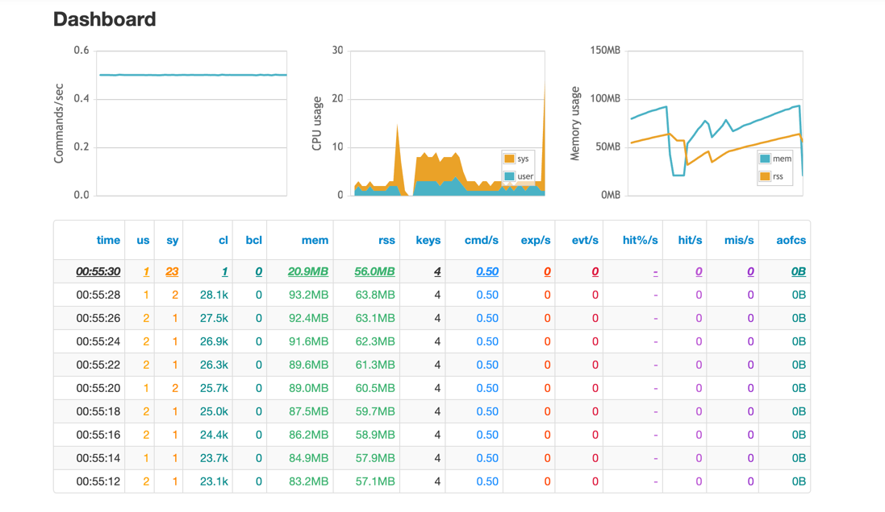

# Redis Load Testing Project

Este projeto tem como objetivo realizar testes de carga em um servidor Redis para avaliar seu desempenho e escalabilidade. Ele consiste em uma configuração Docker Compose que permite configurar e executar testes de carga no Redis.

## Configuração

### Arquivo de Configuração Redis

O servidor Redis é configurado usando o arquivo `redis.conf`. Certifique-se de ajustar as configurações conforme necessário para atender aos requisitos de desempenho do seu projeto.

### Script de test

> Esse projeto usa o [redis-benchmarks](https://redis.io/docs/management/optimization/benchmarks/) para fazer os teste.

O script de teste de carga `redis-load-test.sh` utiliza as seguintes variáveis de ambiente para configurar os testes:

- `TOTAL_REQUESTS`: O número total de solicitações a serem executadas durante o teste. O valor padrão é `1000000`, mas você pode ajustá-lo conforme necessário.

- `CONCURRENT_CLIENTS`: O número de clientes concorrentes que enviarão solicitações ao Redis durante o teste. O valor padrão é `50000`, mas você pode ajustá-lo conforme necessário.

## Executando os Testes

Para executar os testes de carga no Redis, siga estas etapas:

1. Certifique-se de que o Redis esteja configurado corretamente usando o arquivo `redis.conf`.

2. Execute o Docker Compose para iniciar o ambiente de teste:

```bash
docker-compose up --build
```

3. Os resultados dos testes serão gravados no diretório `/output`.

## Visualização de Estatísticas

Este projeto usa o [redis-stat](https://hub.docker.com/r/insready/redis-stat) que pode ser acessada na porta `63790`. Para acessar as estatísticas, abra um navegador da web e vá para `http://localhost:63790`.



## Configuração de Recursos

Se você deseja configurar limites de recursos para o Redis, pode fazê-lo no arquivo `docker-compose.yml`.

```yaml
deploy:
  resources:
    limits:
      cpus: '4'
      memory: '20GB'
```

Use para simular seu ambiente, ou o mais perto dele =D
